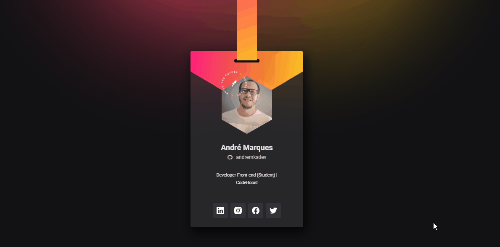
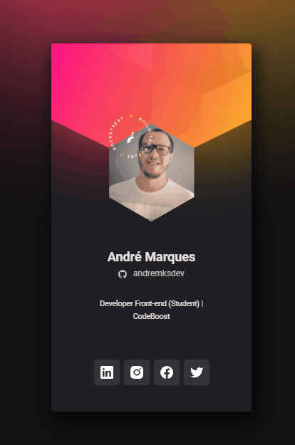

 

<h1 align="center">Welcome 👋 - Crachá Virtual</h1>

<h2>Esse projeto é um desenvolvimento de um crachá virtual</h2>

 <a href="#sobre">Sobre</a> •
 <a href="#deploy">Deploy</a> •
 <a href="#challenges">Challenges</a> •
 <a href="#technologies">Technologies</a> •
 <a href="#autor">Autor</a>

 
<h3 align="center"><strong>Desktop model</strong></h3>

  
  <h3 align="center"><strong>Mobile model</strong></h3>

  

 

<h3 id="sobre"><strong>📝 Sobre</strong></h3>

Desenvolver um crachá (ou cartão) virtual para o evento <a href="https://dowhile.io/inscricao">DoWhile 2021</a>, como parte do aprendizado do conteúdo da imersão <strong>nlw Heat - Trilha Origin</strong> da <strong><a href="https://www.rocketseat.com.br/">Rocketseat 🚀</a></strong> que ocorreu entre os dias 17/10/21 à 22/10/2021.

 

<h3 id="deploy"><strong>🌐 Deploy</strong></h3>

[Github Pages](https://andremksdev.github.io/nlwHeat-cracha-doWhile2021/)

 

<h3 id="challenges"><strong>🎯 Challenges</strong></h3>

- [x] Desktop version
- [x] Apply animations

 

<h3 id="technologies"><strong>⚙️ Technologies</strong></h3>

As tecnologias usadas para esse projeto foram:

- [HTML](https://developer.mozilla.org/en-US/docs/Web/HTML)
- [CSS](https://developer.mozilla.org/en-US/docs/Web/CSS)
- [JS](https://developer.mozilla.org/en-US/docs/Web/JavaScript)

 

<h3 id="autor"><strong>👨‍💻 Autor</strong></h3>

Made by andremksdev 👋

