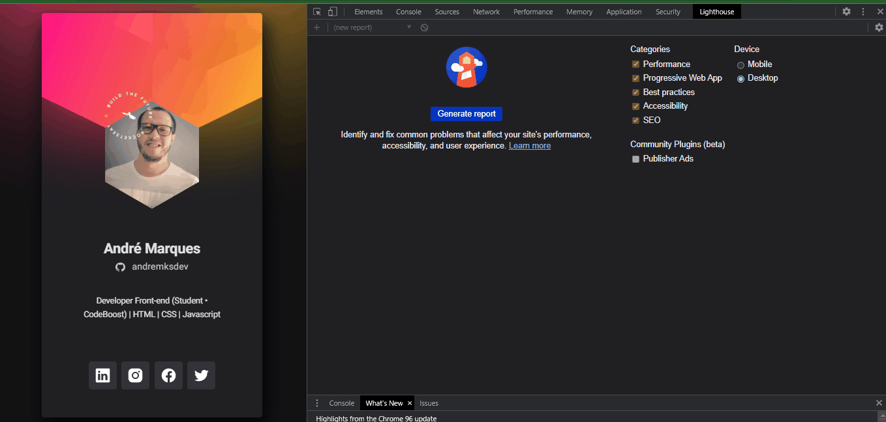

 

<h1 align="center">Welcome 👋 - Crachá Virtual</h1>

<h2>Esse projeto é um desenvolvimento de um crachá virtual</h2>

 <a href="#sobre">Sobre</a> •
 <a href="#layout">Layout</a> •
 <a href="#deploy">Deploy</a> •
 <a href="#audit">Audit Metrics</a> •
 <a href="#challenges">Challenges</a> •
 <a href="#technologies">Technologies</a> •
 <a href="#autor">Autor</a>

 
<h3 align="center"><strong>Desktop model</strong></h3>

  
  <h3 align="center"><strong>Mobile model</strong></h3>

  

 

<h3 id="sobre"><strong>📝 Sobre</strong></h3>

Desenvolver um crachá (ou cartão) virtual para o evento <a href="https://dowhile.io/inscricao"><strong>DoWhile 2021</strong></a>, como parte do aprendizado do conteúdo da imersão <strong>nlw Heat - Trilha Origin</strong> da <a href="https://www.rocketseat.com.br/"><strong>Rocketseat 🚀</strong></a> que ocorreu entre os dias 17/10/21 à 22/10/2021.

 

<h3 id="layout"><strong>📐 Layout</strong></h3>

Project layout made available by the <a href="https://www.rocketseat.com.br/"><strong>ROCKETSEAT</strong></a> group through <a href="https://www.figma.com/file/9Z2vxc8VTRuZpYjFalCMAl/Badge-Do-While2021-(Copy)?node-id=0%3A1"><strong>FIGMA</strong></a>
 
 
 

  

<h3 id="deploy"><strong>🌐 Deploy</strong></h3>

[Github Pages](https://andremksdev.github.io/nlwHeat-cracha-doWhile2021/)

 

<h3 id="audit"><strong>🔍 Audit metrics - Lighthouse</strong></h3>

<h3><strong>Audit web apps with Lighthouse</strong></h3>

Lighthouse is an open-source automated tool that improves the quality of web apps. It can run as a Chrome extension or from the command line. Tell Lighthouse a URL you want to audit. It will run a series of tests on the page and report on the page's performance. In this report, you can use the tests that failed as indicators of what can be done to improve the application.

Note: Right now, Lighthouse focuses primarily on Progressive Web Apps features such as Add to Home screen and offline mode support. However, the overall goal of the project is to provide a comprehensive audit of all aspects of a web app's quality. 

 

  

 

<h3 id="challenges"><strong>🎯 Challenges</strong></h3>

- [x] Desktop version
- [x] Mobile version
- [x] Apply animations CSS
- [x] Apply JS

 

<h3 id="technologies"><strong>⚙️ Technologies</strong></h3>

As tecnologias usadas para esse projeto foram:

- [HTML](https://developer.mozilla.org/en-US/docs/Web/HTML)
- [CSS](https://developer.mozilla.org/en-US/docs/Web/CSS)
- [JS](https://developer.mozilla.org/en-US/docs/Web/JavaScript)

 

<h3 id="autor"><strong>👨‍💻 Autor</strong></h3>

Made by andremksdev 👋

